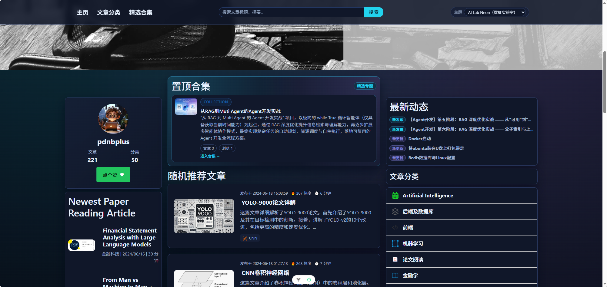
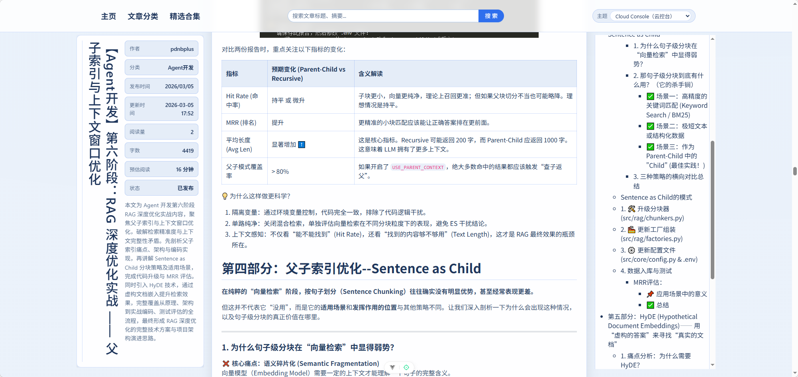

# blog_vue Frontend

博客前端工程（门户 + 后台管理），基于 `Vue 3 + TypeScript + Pinia + Vue Router + Ant Design Vue`。





## 1. 项目简介（面向使用者）

这是一个博客系统前端，包含两部分：

- 门户站点：浏览首页、文章列表、文章详情、分类与合集，支持搜索。
- 后台管理：文章/分类/评论/合集管理，媒体库、日志、个人设置等能力。

访问路径示例：

- 门户首页：`/index/`
- 后台首页：`/admin/dashboard/`
- 后台登录：`/admin/login/`

## 2. 快速开始（面向开发者）

1. 安装依赖

```bash
npm install
```

2. 配置环境变量（参考 `.env.example`）

```bash
VITE_API_BASE_URL=/api/v1
```

3. 启动开发

```bash
npm run dev
```

默认端口：`5174`

## 3. 常用命令

```bash
npm run dev          # 本地开发
npm run lint         # oxlint + eslint
npm run type-check   # vue-tsc
npm run build-only   # 仅构建
npm run build        # type-check + build
npm run test:unit    # Vitest
npm run test:e2e     # Playwright
```

## 4. 技术栈与版本

- `vue@3.5.x`
- `typescript@5.9.x`（`strict: true` + `noUncheckedIndexedAccess: true`）
- `vite@7.x`
- `vue-router@4.x`
- `pinia@3.x`
- `ant-design-vue@4.x`（`unplugin-vue-components` 自动按需注册）
- 其他核心依赖：`axios`、`markdown-it`、`katex`、`dompurify`
- 工程链路：`eslint + oxlint + prettier + vue-tsc + vitest + playwright`

## 5. 目录与职责（可扩展基线）

```text
src/
├── components/                 # 可复用组件（common/layout/pages）
├── composables/                # 组合式逻辑（含 pages/ 页面逻辑）
├── config/                     # 环境与配置封装
├── layouts/                    # 布局壳（DefaultLayout/AdminLayout）
├── router/                     # 路由与守卫
├── services/                   # HTTP 实例 + API 服务层
├── stores/                     # Pinia 模块状态
├── styles/                     # 全局、legacy、页面样式
├── types/                      # 类型定义
├── utils/                      # 通用工具
└── views/                      # 页面入口（按业务域）
```

推荐的新增功能落位规则：

- 新页面：`views/<domain>/<Page>.vue`
- 页面复杂逻辑：`composables/pages/use<Page>.ts`
- 接口调用：`services/api/<domain>.ts`
- 类型：`types/<domain>.ts`
- 可复用业务组件：`components/pages/<domain>/...`
- 若存在跨页面状态：`stores/modules/<domain>.ts`

## 6. 运行时架构约定

- 仅使用 Composition API（`<script setup lang="ts">`）。
- 路由定义集中在 `router/routes.ts`，页面组件全部懒加载。
- 鉴权在 `router/guards.ts`：后台路由统一校验登录态。
- HTTP 统一走 `services/http.ts`（注入 token、统一错误处理）。
- 主题能力由 `composables/useTheme.ts` 管理，入口在 `main.ts` 初始化。
- 动态 favicon 由 `composables/useDynamicFavicon.ts` 在入口初始化。

## 7. 与《前端开发指南》对齐状态（截至 2026-03-06）

已对齐：

- TypeScript 严格模式开启（`tsconfig.app.json`）。
- 全项目使用 Composition API，无 Options API。
- 路由懒加载（`src/router/routes.ts`）。
- Ant Design Vue 按需加载（`vite.config.ts` + resolver）。
- 构建前强制类型检查（`npm run build` -> `vue-tsc --build`）。
- Vite 已启用 `cssCodeSplit` 与 `manualChunks` 分包策略。
- ESLint 已启用 `@typescript-eslint/no-explicit-any`。
- ESLint 已启用 `@typescript-eslint/explicit-function-return-type`（含 `.vue`）。
- ESLint 已启用 `vue/require-explicit-emits`。

部分对齐（仍需演进）：

- 样式体系仍以 `styles/global.css` 为入口，尚未切换到 SCSS 体系。
- 仍存在非 `scoped` 样式块（用于布局壳和内容渲染覆盖），涉及：`src/layouts/DefaultLayout.vue`。
- 仍存在非 `scoped` 样式块（用于布局壳和内容渲染覆盖），涉及：`src/components/pages/home/HomePageContent.vue`。
- 仍存在非 `scoped` 样式块（用于布局壳和内容渲染覆盖），涉及：`src/components/pages/article/ArticleListPageContent.vue`。
- 仍存在非 `scoped` 样式块（用于布局壳和内容渲染覆盖），涉及：`src/components/pages/article/ArticleDetailPageContent.vue`。
- 仍存在非 `scoped` 样式块（用于布局壳和内容渲染覆盖），涉及：`src/components/pages/collection/CollectionPageContent.vue`。

建议的下一步对齐顺序：

1. 增加非 `scoped` 样式白名单注释规范（说明原因与影响范围）。
2. 逐步引入 `styles/*.scss` 并迁移变量/混入层。
3. 为高频业务模块补齐单元测试基线（优先 composables 与 services）。
4. 继续收敛 `legacy` 样式，拆分为按域样式文件。

## 8. 后续开发流程（建议）

1. 先定义类型：`types/<domain>.ts`。
2. 再实现服务：`services/api/<domain>.ts`。
3. 页面逻辑落 `composables/pages`，视图组件保持轻量。
4. 提交前最少执行：

```bash
npm run lint
npm run type-check
npm run build-only
```

5. PR 描述必须包含：
- 影响范围（门户/后台、具体页面）。
- 接口与类型变更点。
- 回归点（登录态、路由守卫、主题切换、移动端样式）。
